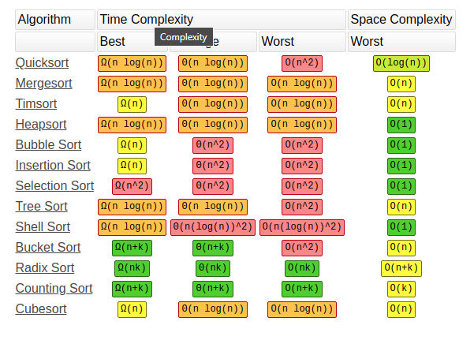

## Sorting

- Most of the time, sorting complexity is O(n log n)

### Cheatsheet
- https://zerotomastery.io/cheatsheets/data-structures-and-algorithms-cheat-sheet/#sorting-algorithms

### Quicksort

- Use the divide-and-conquer paradigm
- The space complexity worst case is O(n^2), but there are ways to avoid this (choosing the right pivot)

1. Choose a pivot element from the array. 
2. Partition the array into two subarrays: one containing elements smaller than the pivot element, and one containing elements larger than the pivot element. 
3. Recursively apply Quick Sort to each subarray until the entire array is sorted.

### Mergesort

- Always O(n log n)
- The space complexity is O(n)