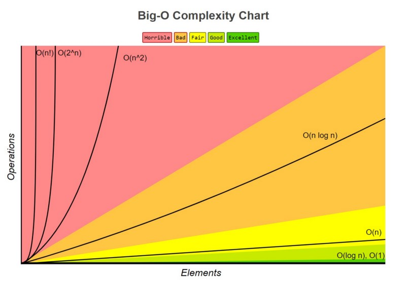

## Cheat Sheet
https://zerotomastery.io/cheatsheets/big-o-cheat-sheet

Big O is used to classify algorithm scalability, measuring how long an algorithm takes to run.

### O(n) - Linear Time

Complexity increase as elements and operations increase on the same amount.

### O(1) - Constant Time

Complexity is constant, no matter how many elements we have.