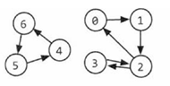

# Graphs

- Trees are a type of graph, but not every graph is a tree.

## Types
- Directed (one-way) and Undirected (two-way).
- Weighted and Unweighted.
- Cyclic and Acyclic.

## Advantages
 
- Relationships

## Disadvantages

- Scaling is hard