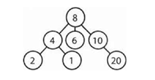
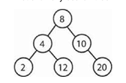
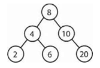
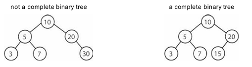
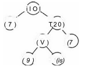
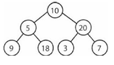
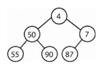
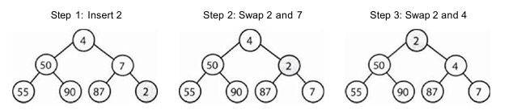
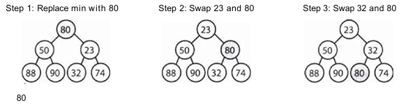
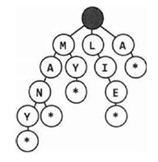

## Trees

- Each tree has a root node.
- Each node have zero or more child nodes.

### Binary Tree

- Is a type of tree in which each node has up to two children.

### Binary Search Tree

- Is a binary tree in which each node follows a specific order.
- All left nodes must be smaller than the parent node.
- All right nodes must be greater than the parent node.

### Complete Binary Tree

- Every level of the tree is fully filled, except perhaps the last level.
- The last level must be filled from left to right.

### Full Binary Tree

- Every node has either 0 or 2 children.

### Perfect Binary Tree

- Is one that is both complete and full.

### Binary Heaps (Min Heaps and Max Heaps)

- Min or Max heap is a Complete Binary Tree
- Each node is smaller than its children (or greater in the case of max heap). So in this case, the root is the minimum (Min Heap) or maximum (Max Heap) element
- Insert always go to the bottom in the next empty space, starting from left to right. Then we bubble up until we find the right spot.
- Finding the min or max value is extremely fast, because they'll always be on top. 
  - When removing this element we must swap with the very last element and bubble it down.

### Tries

- Characters are stored in each node.
- Each path down the tree may represent a word.
- The * nodes are often used to indicate complete words.
- Each node could have anywhere from 1 through the alphabet size + 1 children.

